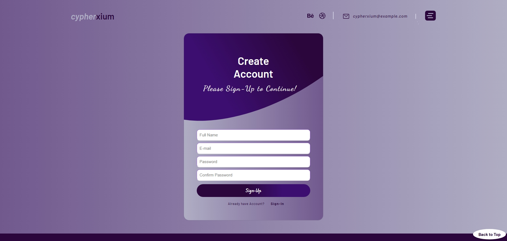
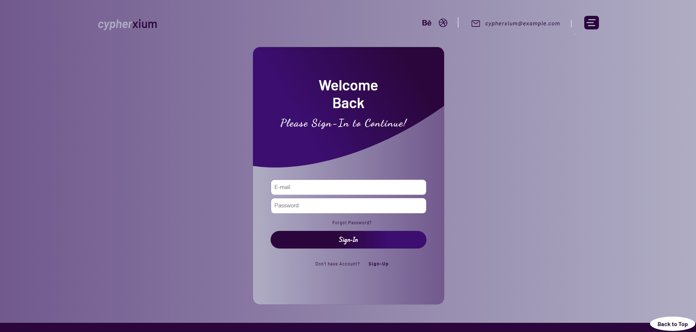

# CypherXium

## (BY: ALI-Hassan : [My-LinkedIN](https://www.linkedin.com/in/ali-hassan-08b306226))

# React Landing Page and Sign-In/Sign-Up

## Project Overview

This project is a React-based web application featuring a landing page and a sign-in/sign-up page. The application includes animations, responsive design, and navigation between different pages.

## Features

- **Landing Page**: The main entry point with a modern design and animations.
- **Sign-In Page**: Allows users to log in with their credentials.
- **Sign-Up Page**: Provides a form for new users to create an account.
- **Animations**: Utilizes `framer-motion` for smooth, engaging transitions.
- **Responsive Design**: Adapts to various screen sizes for a consistent user experience.

## Technologies Used

- React
- React Router DOM
- Styled Components
- Framer Motion
- Icon Libraries (e.g., `react-icons`)

## YouTube Video Link

[CypherXium-React-Project](https://youtu.be/-PhSF6iO-4g)

## Pictures

    
    
    
    

## Getting Started

### Prerequisites

Ensure you have [Node.js](https://nodejs.org/) and [npm](https://www.npmjs.com/) installed on your machine.

### Installation

1. Clone the repository:

   ```bash
   git clone https://github.com/JIN-15/React-Cypherxium.git
   ```

2. Navigate to the project directory:

   ```bash
   cd React-Cypherxium

   # In case of signup-signin

   cd signup-signin
   ```

3. Install dependencies:

   ```bash
   npm install
   ```

### Running the Project

To start the development server, use:

```bash
npm start
```

Visit `http://localhost:3000` in your browser to view the application.

### Building for Production

To create a production build, run:

```bash
npm run build
```

The build will be output to the `build` directory, which can be deployed to a web server.

## Project Structure

- **`src/`**: Contains the source code for the application.
  - **`components/`**: Reusable UI components.
  - **`pages/`**: Page components for different routes.
  - **`App.js`**: Main application component and routing setup.
  - **`index.js`**: Entry point for the React application.

## Usage

### Navigation

- **Landing Page**: Accessed via `/` route. Contains the main content and navigation links.
- **Sign-In Page**: Accessed via `/signin` route. Provides a form for users to log in.
- **Sign-Up Page**: Accessed via `/signup` route. Allows users to create a new account.

### Components

- **`LandingPage`**: Main page component with links to the sign-in and sign-up pages.
- **`SignInPage`**: Page component with a form for user authentication.
- **`SignUpPage`**: Page component for user registration.
- **`Display`**: Contains the main content of the landing page.
- **`AccountBox`**: Container for the sign-in and sign-up forms.

### Animations

Animations are handled using `framer-motion`. Custom animation settings are defined in `animations.js` and applied to various components using the `motion` API.

## Contributing

Feel free to submit issues or pull requests to improve the project. Follow standard GitHub contributing practices.

1. **Fork the Repository**: Create a personal copy of the repository on GitHub by forking it.

2. **Create a New Branch**: Always create a new branch for your changes to keep the main branch clean.

   ```bash
   git checkout -b your-feature-branch
   ```

3. **Make Changes**: Implement your changes or new features.

4. **Commit Your Changes**: Commit your changes with a descriptive message.

   ```bash
   git add .
   git commit -m "Add feature or fix issue"
   ```

5. **Push Changes**: Push your changes to your forked repository.

   ```bash
   git push origin your-feature-branch
   ```

6. **Create a Pull Request**: Submit a pull request from your feature branch to the main repository’s main branch. Provide a detailed description of your changes.


## Contact

For any questions or inquiries, please reach out to [hassanakramali@gmail.com](mailto:hassanakramali@gmail.com).
